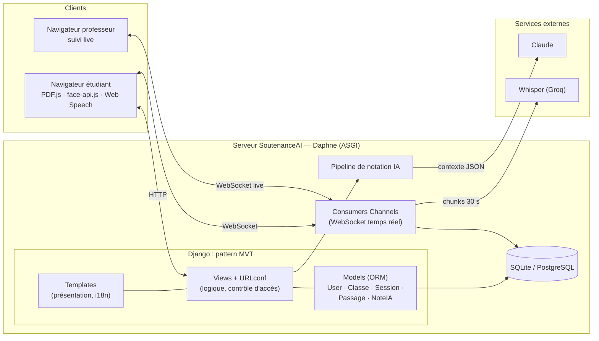
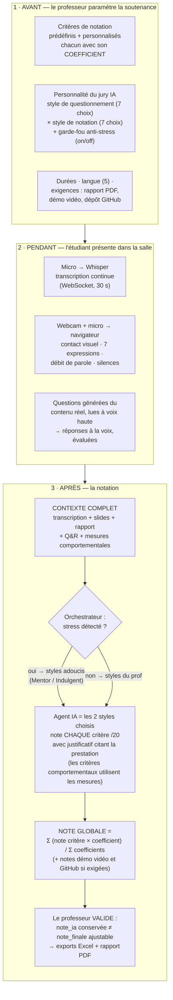

# SoutenanceAI — Présentation orale (8 minutes, puis démo)

> Module *Digital Web Prototyping* — Pr. Bakkas B. — ENSAM Meknès
> **8 slides, 8 minutes.** La démo se lance APRÈS le PowerPoint.
> Diagrammes Mermaid : coller sur **https://mermaid.live** → exporter PNG → insérer dans la slide.

---

## Slide 1 — Titre (30 s)

**Contenu :**
- Logo SoutenanceAI + logo ENSAM
- **SoutenanceAI** — Notation intelligente des soutenances académiques
- DJERI-ALASSANI Oubenoupou — 2ᵉ année IATD-SI
- Digital Web Prototyping — Pr. BAKKAS B. — 2025-2026

**Tu dis :** « J'ai construit une application Django où une IA fait passer la
soutenance : elle écoute, transcrit, pose des questions à voix haute, et propose
une notation que le professeur valide. »

---

## Slide 2 — Problème (1 min)

**Contenu (3 puces) :**
- Le jury fait **tout en même temps** : écouter, préparer les questions, noter
- **Aucune trace** : pas de transcription, pas de mesure, grilles papier
- **Équité variable** : la note dépend de la fatigue et de l'heure de passage

**Visuel :** 3 icônes (oreille / stylo / horloge).

**Tu dis :** « Trois tâches cognitives simultanées, zéro traçabilité. La question :
automatiser la mécanique sans retirer la décision au professeur. »

---

## Slide 3 — Solution (1 min)

**Contenu :**
- **L'IA propose, justifie et trace — le professeur décide.**
- Cycle complet : classes par code d'accès → planification des passages →
  **salle de soutenance interactive** → notation IA par critère → validation prof → exports PDF/Excel
- Transcription en direct, questions posées **à voix haute**, analyse du
  comportement (regard, expressions, voix), notes justifiées

**Visuel :** capture `captures/salle.png` (la salle : slides + webcam + jury IA).

---

## Slide 4 — Technologies (45 s)

**Contenu (1 ligne par brique, pas plus) :**
| Brique | Rôle |
|---|---|
| **Django 4.2 (MVT)** + Channels/ASGI | application web + temps réel WebSocket |
| **Whisper** (Groq) | transcription de la parole en continu |
| **Claude** (Anthropic) | questions + notation justifiée par critère |
| **face-api.js + Web Audio** | comportement, analysé **dans le navigateur** |
| PDF.js · Web Speech · ReportLab | slides, voix de l'IA, rapports PDF |

**Tu dis :** « Django porte tout le cycle MVT du module ; Channels ajoute le temps
réel ; l'analyse faciale reste côté navigateur — confidentialité par conception. »

---

## Slide 5 — Architecture : le pattern MVT + le temps réel (1 min)

**Contenu :** un seul schéma, deux niveaux — l'architecture système (3 couches)
ET le pattern **MVT** détaillé à l'intérieur du serveur Django :

**Tu dis :** « À l'intérieur du serveur, c'est le pattern **MVT** du cours : les
Templates pour la présentation, les Views pour la logique et le contrôle d'accès,
les Models pour l'ORM — 4 applications Django découpées par domaine. À côté du
MVT, les **consumers Channels** ajoutent le canal WebSocket : c'est ce qui permet
au professeur de voir la transcription en temps réel. »

---

## Slide 6 — ⭐ Fonctionnement complet : du paramétrage à la note finale (2 min — LA slide)

> La slide que le prof attend, juste avant la démo. Flowchart en 3 temps
> (AVANT / PENDANT / APRÈS) — il couvre TOUT : le paramétrage par le prof,
> les mesures comportementales, les agents, et le calcul de la note finale.

**Tu dis, en suivant les 3 blocs :**
1. « Tout part du professeur : il définit **sa grille** — des critères pondérés par
   coefficients — et **la personnalité de son jury IA** sur deux axes : le ton des
   questions, et la sévérité du barème. »
2. « Pendant la présentation, deux flux en parallèle : l'audio part vers Whisper
   pour la transcription en direct, et le navigateur mesure le **comportement** —
   contact visuel, expressions, débit, silences. Rien de tout ça ne se perd. »
3. « À la fin, tout converge dans un contexte unique. L'orchestrateur vérifie le
   stress, l'agent note **chaque critère sur 20 avec justification** — les critères
   comportementaux comme "contact visuel" sont notés à partir des **mesures
   réelles**. La note globale est la **moyenne pondérée par les coefficients du
   prof**. Et la note de l'IA reste séparée de la note finale : le professeur a
   toujours le dernier mot. »

---

## Slide 7 — Zoom sur le jury IA : pourquoi des styles, et la preuve qu'ils marchent (1 min)

> Cette slide EXPLIQUE d'abord, et chiffre ensuite — les chiffres ne tombent
> plus de nulle part : ils valident ce qui vient d'être expliqué en slide 6.

**Contenu — en 3 temps (haut vers bas) :**

1. **Le problème** : chaque enseignant a SA façon de noter — un jury unique et
   neutre ne reflète personne.
2. **La réponse** : la personnalité du jury est un **paramètre du prof** —
   7 styles de questionnement × 7 barèmes de notation = 49 jurys possibles,
   chaque style étant un *system prompt* distinct envoyé à Claude.
3. **La preuve que le paramètre agit vraiment** — protocole : *même prestation,
   même grille, seul le style de notation change, 3 répétitions par style*
   (21 appels réels) :

| Style choisi par le prof | Barème annoncé | Note obtenue /20 | σ |
|---|---|---|---|
| Généreux | ≈ 15–18 | **15,50** | 0,00 |
| Juste | ≈ 12–15 | **14,72** | 0,46 |
| Sévère | ≈ 8–12 | **11,17** | 1,00 |
| Terroriste | ≤ 10 | **7,25** | 0,14 |

**Tu dis :** « Question légitime : quand le prof choisit "Sévère", est-ce que ça
change vraiment quelque chose, ou c'est cosmétique ? On l'a mesuré : même
prestation, on ne fait varier QUE le style — l'écart atteint **8 points** entre
les extrêmes, et chaque style retombe dans son barème annoncé avec un écart-type
≤ 1. Le paramètre du professeur pilote donc réellement la note. Et tout le projet
est vérifiable : **258 tests automatisés**. »

---

## Slide 8 — Conclusion (45 s)

**Contenu :**
- Application **complète et fonctionnelle** : 5 langues (RTL arabe), 258 tests,
  isolation des données, secrets hors du code
- Au-delà du CRUD : **HTTP + WebSocket + IA + multimédia** dans un même projet Django
- *Automatiser la mécanique pour rendre du temps au jugement humain*
- **Merci — place à la démo.** (+ QR code → github.com/ZIADEA/SOUTENANCENNOTATIONBYAI)

**Transition démo :** « Vous avez le film en tête — je vous le montre en vrai. »

---

# Après les slides : scénario de démo (hors PowerPoint)

1. Connexion prof (`samira.fadili` / `Demo2026!`) → classe + code/QR → la soutenance configurée (critères, styles IA)
2. Connexion étudiant → **salle** : Démarrer → parler 30 s → montrer la transcription **chez le prof** (2ᵉ onglet)
3. Fin présentation → question IA à voix haute → réponse à la voix
4. Page de notes : note + justificatif par critère → modifier une note → export

**Plan B réseau :** les captures `captures/*.png` reproduisent chaque étape.

# Réponses prêtes aux questions probables

| Question | Réponse en 1 phrase |
|---|---|
| « Pourquoi Django ? » | ORM + auth + i18n intégrés = le cycle complet du module ; Channels ajoute le temps réel sans changer de framework. |
| « Les 49 personnalités changent vraiment la note ? » | Oui, mesuré : 7,25 → 15,50 sur la même prestation, σ ≤ 1 (slide 7). |
| « Que mesure la détection de stress ? » | Densité de marqueurs d'hésitation rapportée au nombre de mots, seuils 2 % et 5 % — simple et assumé. |
| « Confidentialité des visages ? » | Analyse **dans le navigateur** ; seuls des agrégats chiffrés montent au serveur, jamais la vidéo. |
| « Ça tient en charge ? » | Pas en l'état (pipeline bloquant 30-60 s) — documenté, bascule Celery/Redis prévue par configuration. |
| « SQLite en production ? » | Non : SQLite en dev pour la reproductibilité, PostgreSQL par variable `DATABASE_URL`. |

# Check-list jour J

- [ ] Rendre les 2 Mermaid (slides 5 et 6) sur mermaid.live → PNG haute résolution
- [ ] Serveur lancé AVANT de brancher le projecteur : `.venv\Scripts\python.exe manage.py runserver`
- [ ] Données démo : `.venv\Scripts\python.exe _demo_data.py` (mdp `Demo2026!`)
- [ ] Micro + webcam autorisés dans le navigateur (tester le matin)
- [ ] Captures de secours accessibles
- [ ] Chrono : slides 1-4 (3 min 15) · slide 5 (1 min) · slide 6 (2 min) · slides 7-8 (1 min 45)
