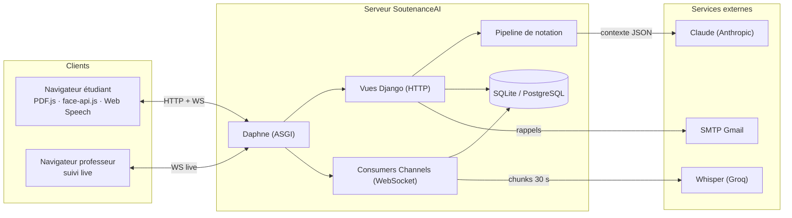
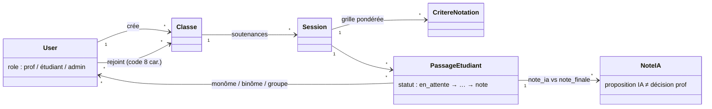
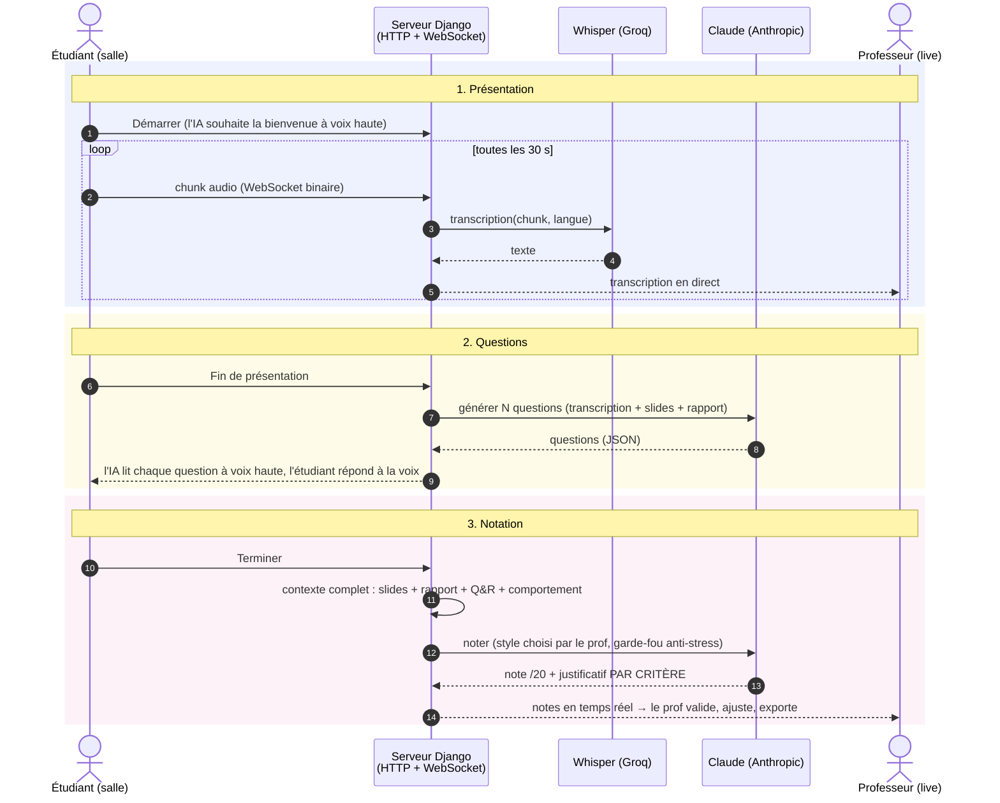

# SoutenanceAI — Contenu de la présentation orale

> Module *Digital Web Prototyping* — Pr. Bakkas B. — ENSAM Meknès
> Durée cible : **10–12 min de présentation + démo**.
> Les diagrammes Mermaid ci-dessous se rendent sur **https://mermaid.live** →
> exporter en PNG et coller dans la slide. Les captures d'écran sont dans `captures/`.

---

## Slide 1 — Titre

**Contenu :**
- Logo SoutenanceAI (`logo-app.jpg`) + logo ENSAM (`logo-ensam.png`)
- **SoutenanceAI** — Plateforme web de gestion et de notation intelligente des soutenances académiques
- DJERI-ALASSANI Oubenoupou — 2ᵉ année cycle ingénieur IATD-SI
- Module : Digital Web Prototyping — Encadrant : Pr. BAKKAS B. — 2025-2026

**Tu dis :** une phrase d'accroche : « J'ai construit une application Django dans
laquelle une IA fait passer une soutenance : elle écoute, transcrit, pose des
questions à voix haute, et propose une notation que le professeur valide. »

---

## Slide 2 — Le problème

**Contenu (3 puces max) :**
- Le jury fait **tout en même temps** : écouter, préparer des questions, noter
- **Aucune trace** : pas de transcription, pas de mesure, grilles papier
- **Équité variable** : la note dépend de la fatigue et de l'heure de passage

**Visuel :** photo/pictogramme d'un jury débordé, ou 3 icônes (oreille, stylo, horloge).

**Tu dis :** « Trois tâches cognitives simultanées, zéro traçabilité. La question :
peut-on automatiser la mécanique sans retirer la décision au professeur ? »

---

## Slide 3 — La solution en une phrase

**Contenu :**
- **L'IA propose, justifie et trace — le professeur décide.**
- 3 briques assemblées :
  - 🎙 Whisper (Groq) → transcription en continu
  - 🧠 Claude (Anthropic) → questions + notation justifiée par critère
  - 👁 face-api.js + Web Audio (navigateur) → regard, expressions, prosodie
- Le tout dans une application **Django** complète : classes, planification, salle
  interactive, exports

**Visuel :** capture `captures/landing.png` ou les 3 logos des briques.

---

## Slide 4 — Lien avec le module (à ne pas zapper : c'est le cours)

**Contenu — tableau 2 colonnes « Notion du cours → Dans le projet » :**
| Notion | Mise en œuvre |
|---|---|
| MVT (Models/Views/Templates) | 4 apps Django à responsabilité unique |
| ORM + migrations | 7 modèles métier, 9 migrations |
| Formulaires + validation | ModelForm, clean_*, critères dynamiques |
| Authentification | AbstractUser + 3 rôles + décorateurs d'accès |
| i18n | 5 langues dont **arabe RTL** |
| **Extension** ASGI/WebSocket | Django Channels, 2 consumers temps réel |

**Tu dis :** « Le projet couvre toutes les notions du module, et les prolonge avec
le temps réel ASGI — j'y reviens dans le fonctionnement. »

---

## Slide 5 — Architecture en 3 couches

**Contenu :** schéma d'architecture (reprendre la figure 3.1 du rapport, ou ce Mermaid) :

**Tu dis :** « Un seul processus Daphne sert deux protocoles : le HTTP classique du
pattern MVT, et le WebSocket pour le temps réel. Le channel layer relie les deux. »

---

## Slide 6 — Modèle de données (simplifié)

**Contenu :** version épurée du diagramme de classes — 5 boîtes, pas d'attributs détaillés :

**Tu dis (2 points clés seulement) :**
- « Une *Classe* façon Google Classroom : l'étudiant la rejoint une fois par code. »
- « *NoteIA* sépare la proposition de l'IA de la note finale du prof : la
  traçabilité de l'ajustement humain est conservée. »

---

## Slide 7 — ⭐ FONCTIONNEMENT : le diagramme de séquence (LA slide pivot)

> C'est la slide que le prof attend : le fonctionnement de bout en bout,
> **avant** la démo. Version simplifiée du diagramme du rapport
> (14 messages au lieu de 32, le serveur Django unifié en une seule ligne de vie).
> Prends 2 bonnes minutes dessus.

**Tu dis, en suivant les numéros :**
1. « L'étudiant démarre ; son micro envoie l'audio par WebSocket **toutes les 30
   secondes**, Whisper transcrit, et le professeur voit la transcription défiler
   **en direct** — c'est le rôle de Django Channels. »
2. « À la fin, Claude génère des questions **tirées du contenu réel** — transcription,
   slides, rapport — et la salle les lit à voix haute. L'étudiant répond à la voix. »
3. « Le pipeline assemble alors tout le dossier — y compris le comportement mesuré
   dans le navigateur — et Claude note **chaque critère sur 20 avec une
   justification qui cite la prestation**. Le professeur reçoit les notes en temps
   réel, les ajuste, et exporte. L'IA propose, le professeur décide. »

**Transition :** « Maintenant que vous avez le film en tête, je vous le montre en vrai. » → DÉMO

---

## Slide 8 — DÉMO (plan de secours inclus)

**Scénario de démo (5-6 min) :**
1. Landing → se connecter en prof (`samira.fadili`) → montrer la classe + le **code/QR**
2. Montrer la soutenance configurée : critères pondérés + **styles IA** (7×7)
3. Se connecter en étudiant → **salle** : slides, webcam, jury IA, Démarrer
   → parler 30-40 s → montrer la **transcription qui arrive chez le prof** (2ᵉ onglet)
4. Fin présentation → l'IA pose une question à voix haute → répondre à la voix
5. Page de notes prof : note IA + justificatif par critère → modifier une note → export

**Plan B si le réseau lâche :** les captures `captures/*.png` (salle,
notes-validation, planifier) reproduisent chaque étape — les avoir dans les slides
suivantes en backup, cachées.

---

## Slide 9 — Le jury IA : 49 personnalités, validées par la mesure

**Contenu (2 colonnes) :**
- Gauche : le double axe — 7 styles de **questionnement** × 7 styles de **notation**
  + garde-fou : si stress détecté → bascule Mentor / Indulgent (désactivable)
- Droite : **le tableau de validation empirique** (21 appels réels, même prestation) :

| Style | Note moyenne /20 | σ |
|---|---|---|
| Généreux | 15,50 | 0,00 |
| Juste | 14,72 | 0,46 |
| Sévère | 11,17 | 1,00 |
| Terroriste | 7,25 | 0,14 |

**Tu dis :** « Même prestation, 8,25 points d'écart entre les extrêmes, écart-type
≤ 1 : les personnalités pilotent réellement et de façon répétable la sévérité.
C'est mesuré, pas déclaré. »

---

## Slide 10 — Qualité logicielle

**Contenu :**
- **258 tests** automatisés (pytest) — exécutables **sans aucune clé API** (mocks)
- Couverture : 56 % global — **100 % sur le contrôle d'accès et les modèles**, 87 % sur les WebSockets
- Sécurité : isolation totale entre professeurs (vérifiée par tests), WebSockets
  authentifiés (4001/4003), secrets en `.env`, analyse faciale **locale au navigateur**
- i18n : 5 langues, RTL arabe complet

**Visuel :** 4 gros chiffres (258 / 56 % / 5 langues / 0 secret dans le code).

---

## Slide 11 — Limites assumées (le prof adore ça)

**Contenu (3 puces honnêtes, pas plus) :**
- Pipeline de notation **synchrone** (30-60 s) → à passer derrière Celery + Redis
- Détection de stress : heuristique simple, marqueurs francophones codés en dur
- Validation empirique partielle : 1 transcription, 1 axe sur 2 — protocole complet
  défini mais non exécuté

**Tu dis :** « Je préfère vous les nommer moi-même : ce sont des dettes
identifiées, localisées dans le code, avec un chemin de résolution connu. »

---

## Slide 12 — Conclusion

**Contenu :**
- Les 5 objectifs atteints (gestion prof / salle immersive / notation justifiée /
  5 langues / qualité vérifiable)
- Au-delà du CRUD : **HTTP + WebSocket + IA + multimédia** dans un même projet Django
- La contribution : *automatiser la mécanique pour rendre du temps au jugement humain*
- **Merci — questions ?** (+ QR code vers github.com/ZIADEA/SOUTENANCENNOTATIONBYAI)

---

## Réponses prêtes aux questions probables

| Question | Réponse en 1 phrase |
|---|---|
| « Pourquoi Django et pas Flask/FastAPI ? » | ORM + auth + i18n + admin intégrés = le cycle complet du module ; Channels ajoute le temps réel sans changer de framework. |
| « Les 49 personnalités, ça change vraiment quelque chose ? » | Oui, mesuré : 7,25 → 15,50 sur la même prestation, σ ≤ 1 (slide 9). |
| « Que mesure exactement la détection de stress ? » | Densité de marqueurs d'hésitation (« euh », « je sais pas »...) rapportée au nombre de mots, seuils 2 % et 5 % — simple et assumé comme tel. |
| « Et la confidentialité des visages ? » | L'analyse faciale tourne **dans le navigateur** (face-api.js) ; seuls des agrégats chiffrés montent au serveur, jamais le flux vidéo d'analyse. |
| « Ça tient en charge ? » | Non en l'état (pipeline bloquant, channel layer mémoire) — c'est documenté, la bascule Celery/Redis est prévue par configuration. |
| « SQLite en prod ? » | Non : SQLite en dev pour la reproductibilité, PostgreSQL par simple variable `DATABASE_URL`. |

---

## Check-list avant de passer

- [ ] Rendre les 3 Mermaid sur mermaid.live → PNG haute résolution dans les slides
- [ ] Tester la démo complète une fois le matin même (micro + webcam autorisés dans le navigateur)
- [ ] Lancer le serveur AVANT de brancher le vidéoprojecteur : `.venv\Scripts\python.exe manage.py runserver`
- [ ] Données de démo prêtes : `.venv\Scripts\python.exe _demo_data.py` (comptes `samira.fadili` / étudiants, mdp `Demo2026!`)
- [ ] Captures de secours dans les slides cachées de fin
- [ ] Chronométrer : 1-2-3-4 rapides (4 min), slide 7 le diagramme (2 min), démo (5-6 min), 9-10-11-12 (3 min)
