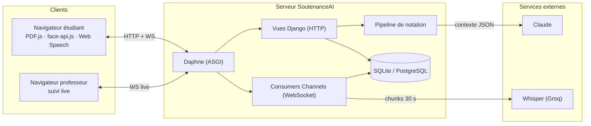
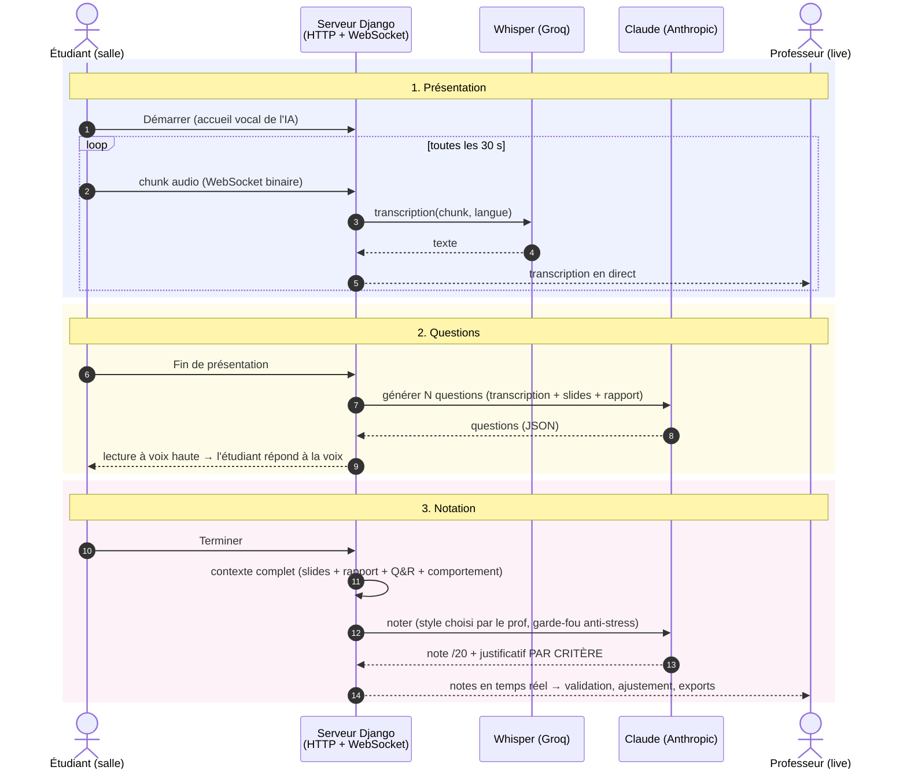

# SoutenanceAI — Présentation orale (8 minutes, puis démo)

> Module *Digital Web Prototyping* — Pr. Bakkas B. — ENSAM Meknès
> **8 slides, 8 minutes.** La démo se lance APRÈS le PowerPoint.
> Diagrammes Mermaid : coller sur **https://mermaid.live** → exporter PNG → insérer dans la slide.

---

## Slide 1 — Titre (30 s)

**Contenu :**
- Logo SoutenanceAI + logo ENSAM
- **SoutenanceAI** — Notation intelligente des soutenances académiques
- DJERI-ALASSANI Oubenoupou — 2ᵉ année IATD-SI
- Digital Web Prototyping — Pr. BAKKAS B. — 2025-2026

**Tu dis :** « J'ai construit une application Django où une IA fait passer la
soutenance : elle écoute, transcrit, pose des questions à voix haute, et propose
une notation que le professeur valide. »

---

## Slide 2 — Problème (1 min)

**Contenu (3 puces) :**
- Le jury fait **tout en même temps** : écouter, préparer les questions, noter
- **Aucune trace** : pas de transcription, pas de mesure, grilles papier
- **Équité variable** : la note dépend de la fatigue et de l'heure de passage

**Visuel :** 3 icônes (oreille / stylo / horloge).

**Tu dis :** « Trois tâches cognitives simultanées, zéro traçabilité. La question :
automatiser la mécanique sans retirer la décision au professeur. »

---

## Slide 3 — Solution (1 min)

**Contenu :**
- **L'IA propose, justifie et trace — le professeur décide.**
- Cycle complet : classes par code d'accès → planification des passages →
  **salle de soutenance interactive** → notation IA par critère → validation prof → exports PDF/Excel
- Transcription en direct, questions posées **à voix haute**, analyse du
  comportement (regard, expressions, voix), notes justifiées

**Visuel :** capture `captures/salle.png` (la salle : slides + webcam + jury IA).

---

## Slide 4 — Technologies (45 s)

**Contenu (1 ligne par brique, pas plus) :**
| Brique | Rôle |
|---|---|
| **Django 4.2 (MVT)** + Channels/ASGI | application web + temps réel WebSocket |
| **Whisper** (Groq) | transcription de la parole en continu |
| **Claude** (Anthropic) | questions + notation justifiée par critère |
| **face-api.js + Web Audio** | comportement, analysé **dans le navigateur** |
| PDF.js · Web Speech · ReportLab | slides, voix de l'IA, rapports PDF |

**Tu dis :** « Django porte tout le cycle MVT du module ; Channels ajoute le temps
réel ; l'analyse faciale reste côté navigateur — confidentialité par conception. »

---

## Slide 5 — Architecture (1 min)

**Contenu :** le schéma 3 couches :

**Tu dis :** « Un seul processus Daphne sert deux protocoles : le HTTP classique du
pattern MVT, et le WebSocket pour le direct. Le channel layer relie les deux —
c'est ce qui permet au professeur de voir la transcription en temps réel. »

---

## Slide 6 — ⭐ Fonctionnement : diagramme de séquence (2 min — LA slide)

> La slide que le prof attend, juste avant la démo. Prends ton temps dessus.

**Tu dis, en suivant les numéros :**
1. « L'étudiant démarre ; son micro envoie l'audio par WebSocket toutes les 30 s,
   Whisper transcrit, le professeur voit le texte défiler **en direct**. »
2. « À la fin, Claude génère des questions **tirées du contenu réel de l'étudiant**,
   la salle les lit à voix haute, l'étudiant répond à la voix. »
3. « Le pipeline assemble tout le dossier — y compris le comportement mesuré dans
   le navigateur — et Claude note **chaque critère sur 20 avec justification**.
   Le professeur valide, ajuste, exporte. L'IA propose, le professeur décide. »

---

## Slide 7 — Le jury IA, validé par la mesure (1 min)

**Contenu (2 colonnes) :**
- Gauche : **7 × 7 = 49 personnalités** (style de questionnement × style de
  notation) + garde-fou anti-stress (bascule Mentor/Indulgent si hésitations)
- Droite : validation empirique — **21 appels réels, même prestation** :

| Style | Moyenne /20 | σ |
|---|---|---|
| Généreux | 15,50 | 0,00 |
| Juste | 14,72 | 0,46 |
| Sévère | 11,17 | 1,00 |
| Terroriste | 7,25 | 0,14 |

**Tu dis :** « Même prestation, 8,25 points d'écart entre extrêmes, écart-type ≤ 1 :
les personnalités pilotent réellement la sévérité. C'est mesuré, pas déclaré.
Et le projet est vérifiable : **258 tests automatisés**. »

---

## Slide 8 — Conclusion (45 s)

**Contenu :**
- Application **complète et fonctionnelle** : 5 langues (RTL arabe), 258 tests,
  isolation des données, secrets hors du code
- Au-delà du CRUD : **HTTP + WebSocket + IA + multimédia** dans un même projet Django
- *Automatiser la mécanique pour rendre du temps au jugement humain*
- **Merci — place à la démo.** (+ QR code → github.com/ZIADEA/SOUTENANCENNOTATIONBYAI)

**Transition démo :** « Vous avez le film en tête — je vous le montre en vrai. »

---

# Après les slides : scénario de démo (hors PowerPoint)

1. Connexion prof (`samira.fadili` / `Demo2026!`) → classe + code/QR → la soutenance configurée (critères, styles IA)
2. Connexion étudiant → **salle** : Démarrer → parler 30 s → montrer la transcription **chez le prof** (2ᵉ onglet)
3. Fin présentation → question IA à voix haute → réponse à la voix
4. Page de notes : note + justificatif par critère → modifier une note → export

**Plan B réseau :** les captures `captures/*.png` reproduisent chaque étape.

# Réponses prêtes aux questions probables

| Question | Réponse en 1 phrase |
|---|---|
| « Pourquoi Django ? » | ORM + auth + i18n intégrés = le cycle complet du module ; Channels ajoute le temps réel sans changer de framework. |
| « Les 49 personnalités changent vraiment la note ? » | Oui, mesuré : 7,25 → 15,50 sur la même prestation, σ ≤ 1 (slide 7). |
| « Que mesure la détection de stress ? » | Densité de marqueurs d'hésitation rapportée au nombre de mots, seuils 2 % et 5 % — simple et assumé. |
| « Confidentialité des visages ? » | Analyse **dans le navigateur** ; seuls des agrégats chiffrés montent au serveur, jamais la vidéo. |
| « Ça tient en charge ? » | Pas en l'état (pipeline bloquant 30-60 s) — documenté, bascule Celery/Redis prévue par configuration. |
| « SQLite en production ? » | Non : SQLite en dev pour la reproductibilité, PostgreSQL par variable `DATABASE_URL`. |

# Check-list jour J

- [ ] Rendre les 2 Mermaid (slides 5 et 6) sur mermaid.live → PNG haute résolution
- [ ] Serveur lancé AVANT de brancher le projecteur : `.venv\Scripts\python.exe manage.py runserver`
- [ ] Données démo : `.venv\Scripts\python.exe _demo_data.py` (mdp `Demo2026!`)
- [ ] Micro + webcam autorisés dans le navigateur (tester le matin)
- [ ] Captures de secours accessibles
- [ ] Chrono : slides 1-4 (3 min 15) · slide 5 (1 min) · slide 6 (2 min) · slides 7-8 (1 min 45)
