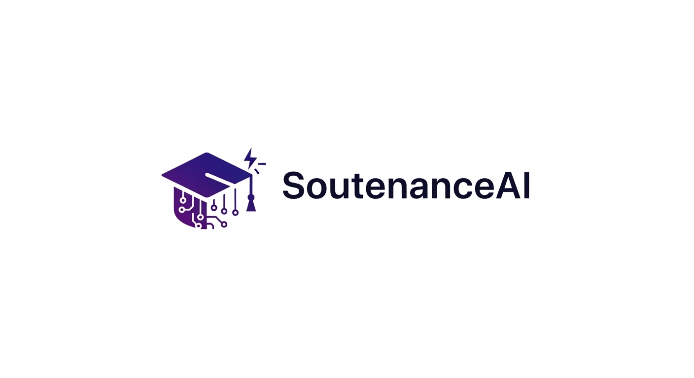
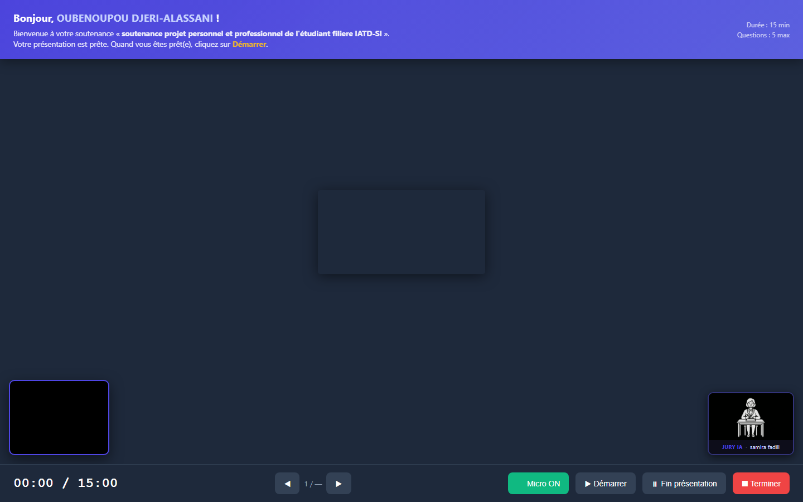
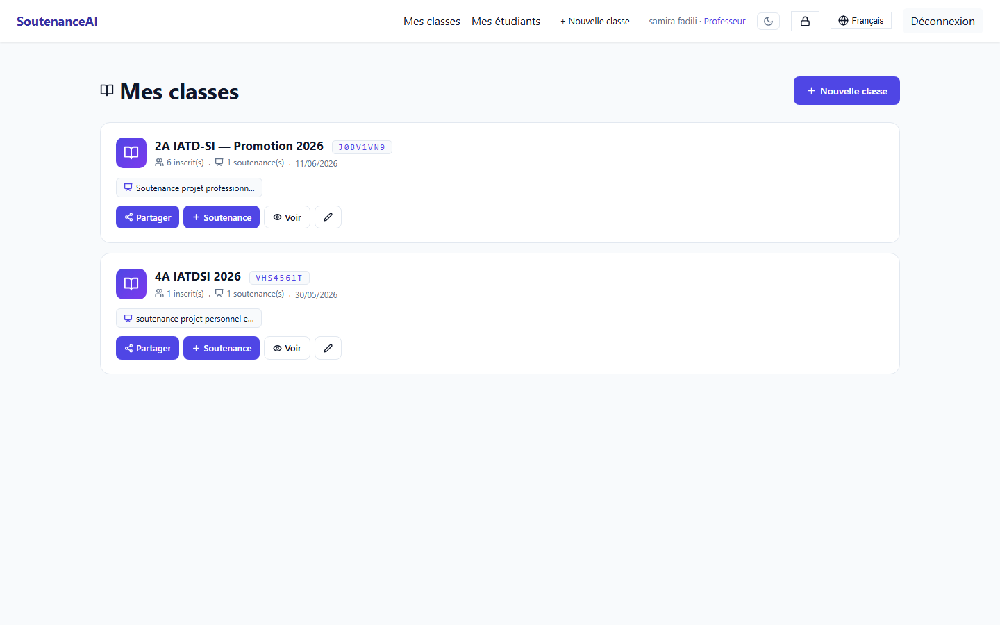
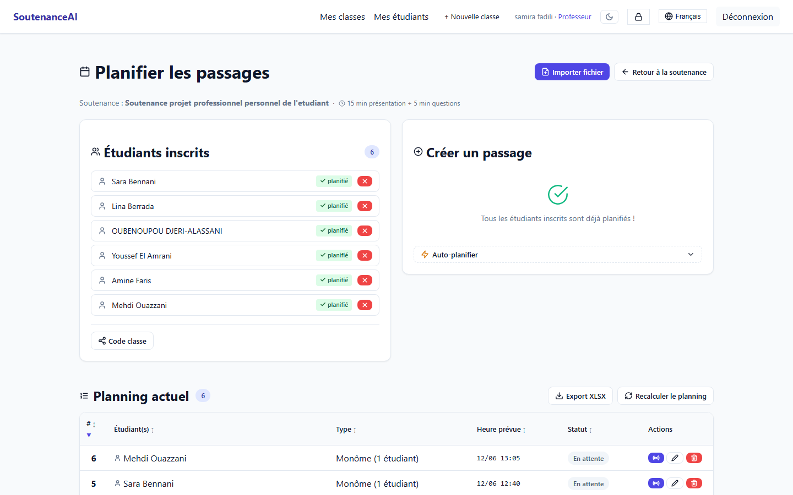
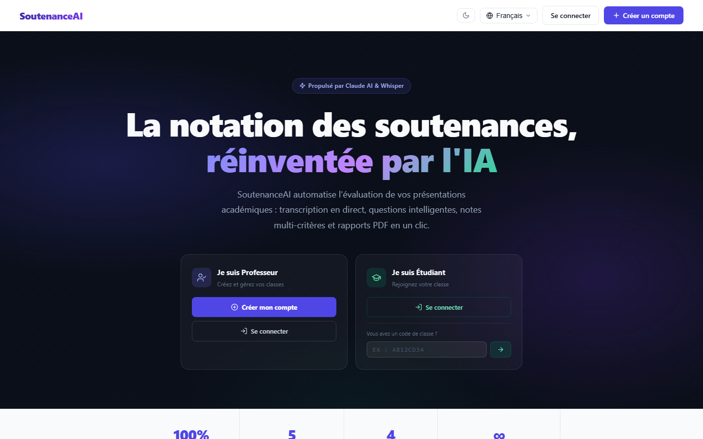
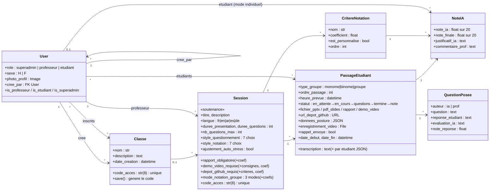
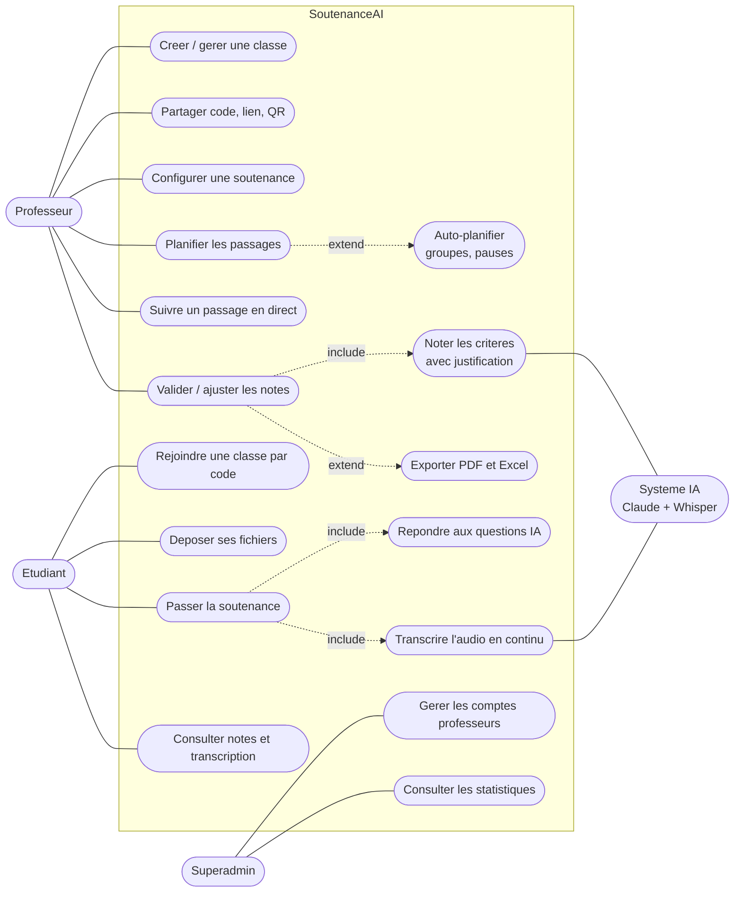
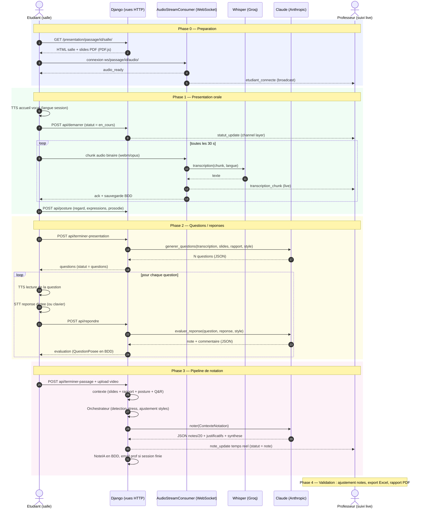

<p align="center">
  
</p>

# SoutenanceAI

**Plateforme web de gestion et de notation intelligente des soutenances académiques.**
Une IA examinatrice transcrit la présentation orale de l'étudiant en direct, lui pose des
questions à voix haute, analyse son comportement (regard, expressions, prosodie) et propose
une notation multi-critères justifiée — que le professeur valide, ajuste et exporte en PDF.

> Projet académique — cours *Digital Web Prototyping*, ENSAM Meknès.
> Auteur : **DJERI-ALASSANI OUBENOUPOU**.

---

## Aperçu

| Salle de soutenance (étudiant) | Dashboard professeur |
|---|---|
|  |  |

| Planification des passages | Page d'accueil |
|---|---|
|  |  |

*Plus de captures dans le dossier [`captures/`](../captures/).*

---

## Sommaire

1. [Fonctionnalités](#fonctionnalités)
2. [Stack technique](#stack-technique)
3. [Installation](#installation) — et [alternatives aux fichiers non versionnés](#fichiers-volontairement-absents-du-dépôt--et-leurs-alternatives)
4. [Lancement](#lancement)
5. [Architecture](#architecture)
6. [Modèle de données — diagramme de classes](#modèle-de-données--diagramme-de-classes)
7. [Cas d'utilisation](#cas-dutilisation)
8. [Flux complet d'une soutenance — diagramme de séquence](#flux-complet-dune-soutenance)
9. [Le système IA en détail](#le-système-ia-en-détail)
10. [Internationalisation](#internationalisation)
11. [Tests](#tests)
12. [Sécurité](#sécurité)
13. [Limitations connues et perspectives](#limitations-connues-et-perspectives)

---

## Fonctionnalités

### Pour le professeur
- **Auto-inscription** libre sur la plateforme (aucune validation manuelle requise).
- **Classes** façon Google Classroom : chaque classe possède un **code d'accès à 8 caractères**,
  un lien direct et un **QR code** que les étudiants scannent pour rejoindre.
- **Soutenances configurables** dans chaque classe : langue (5 choix), durée de présentation,
  durée et nombre max de questions, rapport PDF obligatoire ou non, **démo vidéo** optionnelle
  avec consignes, **dépôt GitHub** optionnel avec critères d'évaluation — chacun avec son coefficient.
- **Critères de notation** : grille prédéfinie (clarté, structure, rigueur…) + critères
  personnalisés, chacun pondéré par un coefficient.
- **Personnalité du jury IA sur deux axes indépendants** :
  - *Style de questionnement* (7 profils) : Mentor, Pédagogue, Perfectionniste, Contradicteur,
    Stratège, Provocateur, Impassible ;
  - *Style de notation* (7 profils) : Généreux, Indulgent, Juste, Avare de points, Sévère,
    Terroriste, Comptable.
  - **Ajustement anti-stress** : si l'étudiant montre des signes de stress, l'orchestrateur
    bascule automatiquement vers Mentor / Indulgent (désactivable).
- **Planification des passages** : manuelle (formulaire inline) ou **automatique**
  (monôme/binôme/groupe, ordre alphabétique ou aléatoire, durée + pause configurables),
  import de groupes depuis un fichier, recalcul d'horaires en cascade, **export Excel** du planning.
- **Suivi live** d'un passage par WebSocket : transcription en direct, statut, notes IA
  qui apparaissent en temps réel, possibilité d'**envoyer une question** que l'IA lit à voix
  haute à l'étudiant.
- **Validation des notes** : chaque note IA est justifiée par un commentaire citant la
  transcription ; le prof peut la modifier, commenter, re-déclencher la notation, **exporter
  les notes en Excel** et générer un **rapport PDF individuel** (ReportLab).
- **Notification email** quand tous les passages d'une soutenance sont notés.

### Pour l'étudiant
- **Rejoindre une classe** par code, lien ou QR — création de compte en une étape
  (identifiant choisi librement, vérifié et validé).
- **Dashboard** listant ses classes, les soutenances de chaque classe et l'état de son
  passage (planifié avec heure, ou « non encore planifié »).
- **Préparation** : dépôt du PPTX (converti automatiquement en PDF et affiché slide par
  slide dans le navigateur via PDF.js), du rapport PDF, de la démo vidéo et de l'URL GitHub
  selon la configuration de la soutenance.
- **Salle de soutenance** type visioconférence :
  - slides au centre, webcam de l'étudiant en bas à gauche, **avatar du jury IA** en bas à droite ;
  - timer de présentation, contrôle du micro, badge REC ;
  - **transcription continue** : le micro envoie des chunks audio de 30 s par WebSocket,
    transcrits par Whisper ;
  - en fin de présentation, l'IA **génère des questions** tirées du contenu réel
    (transcription + slides + rapport) et **les lit à voix haute** (synthèse vocale dans la
    langue de la soutenance) ;
  - l'étudiant répond **à la voix** (dictée vocale) ou au clavier ; chaque réponse est
    évaluée immédiatement par l'IA ;
  - **analyse comportementale en temps réel** côté navigateur (face-api.js + Web Audio API) :
    contact visuel, 7 expressions faciales, identification du locuteur par photo de profil
    (passages en groupe), volume et débit de parole, ratio de silence ;
  - enregistrement vidéo complet du passage.
- **Rappel automatique par email 10 minutes avant** l'heure prévue du passage.
- **Consultation des résultats** : notes par critère, synthèse comportementale, transcription,
  enregistrement vidéo.

### Pour le superadmin
- Gestion des comptes professeurs, statistiques globales, accès à toutes les soutenances.

### Transverse
- **5 langues d'interface** : français, anglais, **arabe (RTL complet)**, espagnol, allemand —
  changement de langue sur toutes les pages, y compris la landing page et la salle.
- **Thème clair / sombre** persistant avec script anti-flash.
- **Icônes Lucide** uniformes (zéro emoji dans le code).
- Identité visuelle unifiée indigo/violet via variables CSS.

---

## Stack technique

| Couche | Technologie |
|---|---|
| Backend | Django 4.2 (Python), Django REST Framework |
| Temps réel | Django Channels 4 + Daphne (ASGI), WebSocket |
| Base de données | SQLite (dev) / PostgreSQL via `DATABASE_URL` (prod) |
| IA — notation & questions | Anthropic **Claude** (modèle configurable via `.env`) |
| IA — transcription | **Whisper large-v3** hébergé sur Groq (API) |
| IA — comportement | **face-api.js** (expressions, reconnaissance) + Web Audio API (prosodie) — 100 % côté navigateur |
| Fichiers | python-pptx, PyMuPDF, Pillow, conversion PPTX→PDF (LibreOffice ou PowerPoint COM) |
| Rapports | ReportLab (PDF), openpyxl (Excel) |
| Frontend | Templates Django + CSS/JS vanilla, PDF.js, Lucide icons |
| i18n | Django i18n + polib (compilation .mo sans GNU gettext) |
| Tests | pytest, pytest-django, pytest-asyncio — **258 tests** |

---

## Installation

```powershell
# 1. Cloner et créer l'environnement virtuel
git clone https://github.com/ZIADEA/SOUTENANCENNOTATIONBYAI.git
cd SOUTENANCENNOTATIONBYAI/soutenanceai
python -m venv .venv
.\.venv\Scripts\Activate.ps1

# 2. Dépendances
pip install -r requirements.txt

# 3. Configuration
copy .env.example .env
# Éditer .env : SECRET_KEY, ANTHROPIC_API_KEY, GROQ_API_KEY au minimum

# 4. Base de données
python manage.py migrate

# 5. Compiler les traductions (polib — pas besoin de GNU gettext)
python compile_messages.py

# 6. Créer le superadmin — ou générer des comptes de démonstration
python manage.py createsuperuser
# OU
python manage.py seed     # crée admin/admin123, prof.martin/prof1234 + étudiants démo
```

### Fichiers volontairement absents du dépôt — et leurs alternatives

Par sécurité et hygiène, certains fichiers ne sont **pas versionnés**. Chacun a
une alternative fournie :

| Non versionné | Pourquoi | Alternative incluse dans le dépôt |
|---|---|---|
| `soutenanceai/.env` | Contient les **clés API réelles** (Anthropic, Groq, Gmail) | **`.env.example`** : modèle complet de toutes les variables — copier en `.env` et remplir |
| `db.sqlite3` | Base de données locale (comptes, données personnelles) | **`manage.py migrate`** recrée le schéma exact (9 migrations versionnées) + **`manage.py seed`** génère des comptes et une session de démonstration |
| `media/` | Fichiers uploadés par les utilisateurs (PPTX, PDF, enregistrements vidéo personnels) | Recréé automatiquement par Django au premier upload — aucune action requise |
| `.venv/` | Environnement Python local | **`requirements.txt`** : `pip install -r requirements.txt` reconstruit l'environnement à l'identique |
| `locale/*/django.mo` compilés ✔ inclus | — | Re-compilables à tout moment : `python compile_messages.py` |

> En clair : `git clone` + les 6 étapes ci-dessus = application **100 % fonctionnelle**,
> sans aucun fichier secret.

Variables d'environnement principales (`.env`) :

| Variable | Rôle |
|---|---|
| `SECRET_KEY` | Clé secrète Django |
| `ANTHROPIC_API_KEY` | Notation, questions, évaluations (Claude) |
| `GROQ_API_KEY` | Transcription Whisper |
| `CLAUDE_MODEL` / `WHISPER_MODEL` | Modèles utilisés |
| `DATABASE_URL` | Postgres en production (vide = SQLite) |
| `REDIS_URL` | Channel layer Redis en production (vide = InMemory) |
| `EMAIL_HOST_USER` / `GMAIL_APP_PASSWORD` | Envoi des rappels et notifications |

## Lancement

```powershell
# Développement (WebSocket inclus — Channels remplace runserver par Daphne)
.\.venv\Scripts\python.exe manage.py runserver

# Ou explicitement via Daphne (ASGI)
daphne -p 8000 soutenanceai.asgi:application
```

Ouvrir **http://127.0.0.1:8000/** — la landing page propose les parcours
professeur (inscription) et étudiant (code de classe).

Le **thread de rappels email** (10 min avant chaque passage) démarre automatiquement
avec le serveur — aucune commande supplémentaire. Une management command manuelle
existe aussi : `python manage.py envoyer_rappels`.

---

## Architecture

```
soutenanceai/
├── manage.py
├── compile_messages.py        # Compilation .po → .mo via polib (Windows-friendly)
├── requirements.txt
├── .env.example
├── soutenanceai/              # Configuration du projet
│   ├── settings.py            # .env, i18n, Channels, médias
│   ├── urls.py                # Routes racines (/, /accounts/, /sessions/, /notation/, /presentation/, /i18n/)
│   ├── asgi.py                # ProtocolTypeRouter : HTTP + WebSocket
│   └── wsgi.py
├── accounts/                  # Utilisateur custom (3 rôles), auth, inscription prof,
│   │                          # import CSV étudiants, reset mdp, décorateurs d'accès
│   └── management/commands/seed.py
├── sessions_app/              # Classe, Session (soutenance), CritereNotation,
│   │                          # PassageEtudiant, planification auto, imports, exports XLSX,
│   │                          # rejoindre par code, emails de rappel (thread + command)
├── notation/                  # NoteIA, QuestionPosee, agents Claude (2 axes × 7 styles),
│   │                          # orchestrateur anti-stress, pipeline de notation,
│   │                          # services (Whisper, PPTX, PDF, posture), rapports PDF,
│   │                          # consumers WebSocket (live + audio)
├── presentation/              # Dashboard étudiant, upload fichiers, salle de soutenance,
│                              # APIs de salle (démarrer, terminer, répondre, posture…)
├── templates/                 # Templates Django (base.html + landing + pages)
├── static/css|js|img         # main.css (variables, thèmes), avatars jury
├── locale/{en,ar,es,de}/      # Traductions (fr = langue source)
├── fixtures/
└── tests/                     # 258 tests pytest (modèles, vues, agents, pipeline,
                               # consumers WebSocket, services, emails)
```

### Pattern MVT

L'application suit strictement le pattern **MVT (Model-View-Template)** de Django,
variante du MVC où le framework joue lui-même le rôle de contrôleur (routage URL) :

- **Models** — `accounts/models.py`, `sessions_app/models.py`, `notation/models.py`
  (ORM, contraintes, propriétés métier) ;
- **Views** — fonctions décorées par rôle (`@professeur_required`, `@etudiant_required`,
  `@superadmin_required`) qui filtrent systématiquement par propriétaire ;
- **Templates** — héritage depuis `base.html`, tags i18n, variables CSS partagées.

S'y ajoute une couche **temps réel** (consumers Channels) et une couche **services/agents**
(logique IA isolée des vues, testable unitairement).

---

## Modèle de données — diagramme de classes



### Cycle de vie d'un passage

```mermaid
stateDiagram-v2
    direction LR
    [*] --> en_attente : planification
    en_attente --> en_cours : Demarrer
    en_cours --> questions : Fin presentation
    questions --> termine : Terminer
    termine --> note : pipeline IA
    note --> [*]
```

---

## Cas d'utilisation



## Flux complet d'une soutenance

### Diagramme de séquence



### Description pas à pas

1. **Le professeur** crée une classe → partage le code/QR → les étudiants rejoignent
   (création de compte intégrée).
2. Il crée une **soutenance** dans la classe : critères, durées, styles IA, exigences
   (rapport, démo, GitHub), puis **planifie les passages** (manuel ou auto).
3. **10 minutes avant son passage**, l'étudiant reçoit un **email de rappel** automatique.
4. **L'étudiant** dépose ses fichiers ; le PPTX est converti en PDF et rendu dans la salle.
5. Dans la **salle**, il clique sur Démarrer : l'IA le souhaite la bienvenue à voix haute,
   le timer démarre, le micro envoie l'audio par WebSocket, Whisper transcrit en continu,
   face-api.js mesure regard/expressions, la Web Audio API mesure la prosodie.
6. **Le professeur** peut suivre tout cela **en direct** et poser ses propres questions.
7. En fin de présentation, **Claude génère N questions** ancrées dans le contenu réel ;
   l'IA les lit à voix haute, l'étudiant répond à la voix, chaque réponse est évaluée.
8. Le **pipeline de notation** s'exécute : contexte complet (transcription, slides, rapport,
   Q&R, comportement, durée réelle vs prévue) → orchestrateur (ajustement anti-stress
   éventuel) → Claude note **chaque critère sur 20 avec justification citant le texte** ;
   démo vidéo et dépôt GitHub sont évalués séparément si exigés.
9. Les notes apparaissent **en temps réel** chez le professeur, qui valide/ajuste, exporte
   en **Excel** ou génère le **rapport PDF**. Quand tous les passages sont notés, il reçoit
   un **email de synthèse**.

---

## Le système IA en détail

### Double axe de personnalité (7 × 7 = 49 combinaisons)
Le *style de questionnement* gouverne le ton des questions ; le *style de notation*
gouverne la sévérité du barème. Chaque style est un **system prompt** distinct
(`notation/agents.py`), les deux étant concaténés pour l'évaluation finale.

### Orchestrateur anti-stress
Avant chaque notation, une heuristique mesure le taux de marqueurs d'hésitation
(« euh », « je sais pas »…) dans la transcription. Si l'étudiant est jugé *stressé*
et que le professeur a activé l'option : les styles agressifs (Contradicteur, Provocateur,
Impassible) basculent vers **Mentor**, les barèmes durs (Sévère, Terroriste, Avare)
vers **Indulgent**.

### Contexte de notation
L'IA reçoit un dossier complet : transcription horodatée, texte des slides et du rapport,
consignes du professeur, critères pondérés, session Q&R intégrale, données comportementales
agrégées (contact visuel %, émotion dominante, débit de parole interprété, ratio de silence,
variation d'intonation), durée réelle vs prévue — et doit répondre en **JSON strict**
avec une note et un justificatif **citant le texte** pour chaque critère.

### Notation de groupe
Trois modes : note **identique** pour le groupe, note **individuelle** par membre
(transcriptions séparées par locuteur grâce à l'identification faciale), ou **mixte**
pondéré (`coef_groupe × note_collective + coef_individuel × note_individuelle`).

---

## Internationalisation

- 5 langues : **fr** (source), **en**, **ar** (RTL complet : `dir="rtl"`, styles dédiés),
  **es**, **de**.
- Sélecteur de langue sur toutes les pages (y compris landing et salle).
- La **langue de la soutenance** est indépendante de la langue d'interface : questions IA,
  synthèse vocale et transcription Whisper suivent la langue choisie par le professeur.
- Compilation des `.po` sans GNU gettext : `python compile_messages.py` (polib).

## Tests

```powershell
.\.venv\Scripts\python.exe -m pytest tests/ -q
# 258 passed
```

Couverture fonctionnelle : modèles (génération de codes, statuts), vues (contrôle d'accès
par rôle, isolation entre professeurs, formulaires), agents IA (mocks Claude, styles,
orchestrateur, parsing JSON), pipeline de notation, consumers WebSocket (connexion,
autorisation 4001/4003, broadcast de transcription), services (Whisper mocké, extraction
PPTX/PDF, résumé posture), emails.

## Sécurité

- Décorateurs de rôle sur **toutes** les vues + filtrage systématique par propriétaire
  (`professeur=request.user`) → isolation totale entre professeurs (vérifiée par tests).
- Accès étudiant restreint à **ses** passages (`PermissionDenied` sinon).
- WebSockets authentifiés : code 4001 (non connecté) / 4003 (non autorisé).
- Secrets dans `.env` (jamais commité — voir `.gitignore`), `.env.example` fourni.
- CSRF actif partout ; les endpoints de salle exemptés sont authentifiés et vérifient
  l'appartenance au passage.

## Limitations connues et perspectives

- [ ] Pipeline de notation **synchrone** → à passer derrière Celery + Redis en production.
- [ ] `InMemoryChannelLayer` en dev → Redis (`REDIS_URL`) obligatoire en multi-worker.
- [ ] Conversion PPTX→PDF dépend de LibreOffice ou PowerPoint sur la machine hôte.
- [ ] Déploiement : nécessite un hébergeur à processus persistant (Railway, Render, VPS) —
  incompatible serverless (WebSockets + tâches longues).
- [ ] Streaming audio continu vers Whisper plutôt que chunks de 30 s.

## Licence

Projet académique — ENSAM Meknès, cours *Digital Web Prototyping* (Pr. Bakkas B.).
